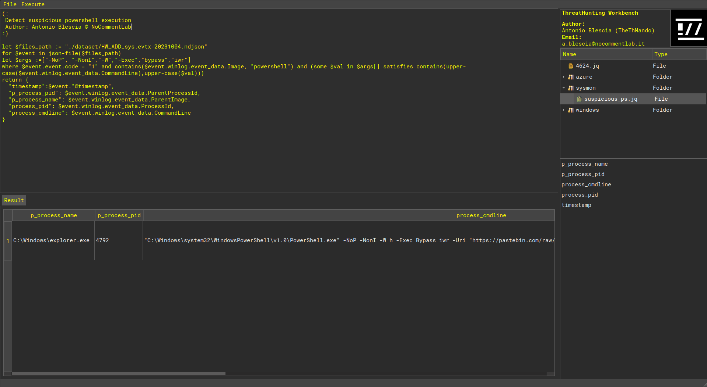
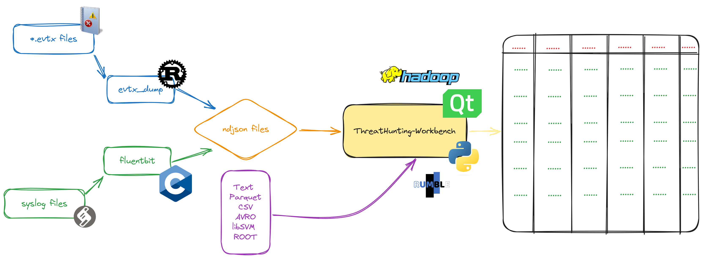

# ThreatHunting Workbench 🕵️‍♂️

As a ThreatHunter, I work daily with various types of files that need to be analyzed.

Each type of file requires preprocessing before analysis. Additionally, these files must be ingested into software that allows for detection or correlation (e.g., Elasticsearch, Opensearch, etc.).

For this reason, I decided to develop the **ThreatHunting Workbench**.

Through this tool, logs are initially normalized into a ***.ndjson** format and then queried using a querying language called **JSONIq**.

ThreatHunting Workbench uses a RumbleDb database leveraging Hadoop runtimes, making it stable and highly efficient.

## Install the openjdk-8-jdk package

The openjdk-8-jdk package is used to run the rumbledb runtime. To install the package, run the following command: `sudo apt install openjdk-8-jdk`.

## Download the Hadoop native libraries

Hadoop is an open-source framework designed for storing and processing large datasets across clusters of computers using simple programming models. It was developed by Doug Cutting and Mike Cafarella and has become synonymous with big data processing.

To download the latest version, visit the following link:  **https://hadoop.apache.org/releases.html** and select the package inside the **Binary download** column.

Subsequently, ensure that the **/lib/native** folder is present in the package. This folder contains several shared objects.

## Download and execute RumbleDB with Hadoop native libraries

RumbleDB is an open-source JSONiq engine that allows for processing large amounts of JSON data. JSONiq is an extension of the popular XQuery language, tailored specifically to query and transform JSON data. RumbleDB operates on top of the Apache Spark big data framework, leveraging Spark's distributed computing capabilities to handle very large datasets efficiently.

To download the rumbledb package, visit and download the runtime from this link: [https://github.com/RumbleDB/rumble/releases](https://github.com/RumbleDB/rumble/releases).

RumbleDB, being built on top of Apache Spark, can require the Hadoop Native Library file for several reasons, mostly related to enhancing performance and compatibility when interacting with the Hadoop ecosystem. For this reason, you need to run the rumbledb instance with the following command:

`java -jar -Djava.library.path=/home/antonio/Downloads/hadoop-3.3.6/lib/native ./bin/rumbledb-1.21.0-standalone.jar serve -p 9090`

## Convert *.evtx files to *.ndjson format

1. Download **evtx_dump** from [here](https://github.com/omerbenamram/evtx/releases/);
2. Set the execution flag with `chmod +x <evtx_dump binary>`
3. Convert the file with `/evtx_dump-v0.8.2-x86_64-unknown-linux-gnu -t 1 -o jsonl -f PowerShell_Operational.ndjson Microsoft-Windows-PowerShell%4Operational.evtx`
   If you need a bulk conversion, use the following inline command: `for file in *.evtx; do ./evtx_dump-v0.8.2-x86_64-unknown-linux-gnu -t 1 -o jsonl -f "${file%.evtx}.ndjson" "$file"; done`.

## Convert syslog files to *.ndjson format

TODO.